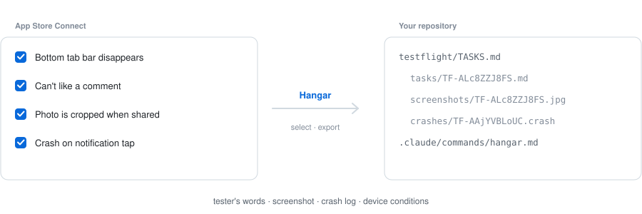
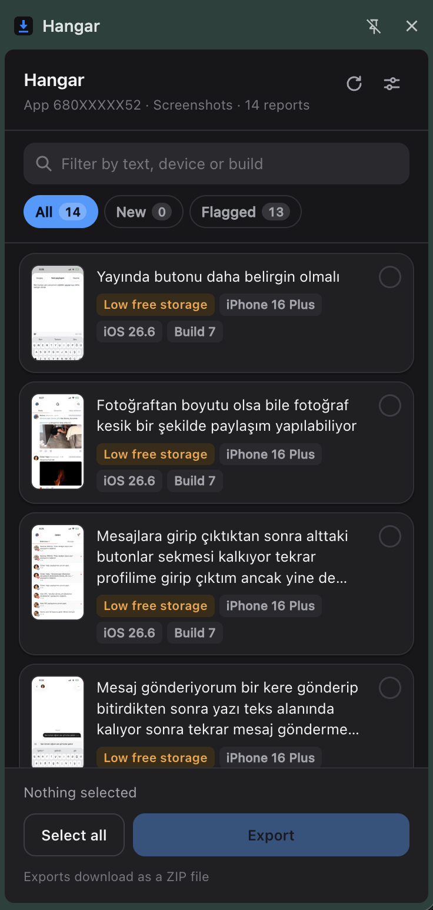
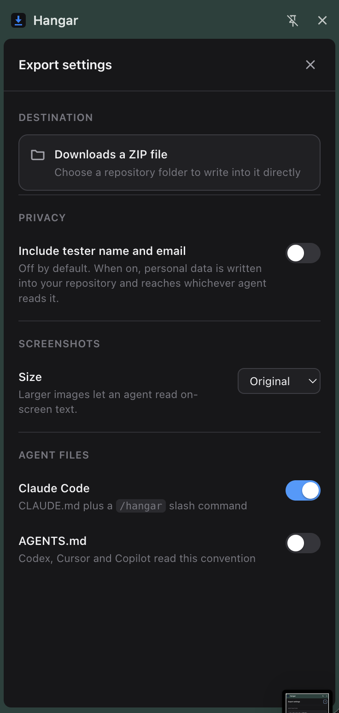

<div align="center">

# Hangar

**Turn TestFlight feedback into agent-ready tasks.**

[](LICENSE)
[](manifest.json)
[](package.json)
[](test/harness.html)

<picture>
  <source media="(prefers-color-scheme: dark)" srcset="docs/flow-dark.svg">
  
</picture>

</div>

---

A Chrome extension for the TestFlight feedback pages in App Store Connect. Tick
the reports you actually intend to fix and Hangar writes them into your
repository as tasks a coding agent can work through — the tester's own words,
the screenshot they took, the crash log, and the state their device was in at
the time.

No account, no API keys, no CI setup. Open App Store Connect and export.

## Why

App Store Connect lets you read feedback one card at a time and download
screenshots one at a time. Everything after that is manual: retyping the report
into an issue, finding the screenshot again, guessing which of forty reports are
the same bug.

Hangar does the mechanical part and hands the result to the tool that is
already sitting in your terminal.

## Install

Not on the Chrome Web Store yet. To run it from source:

1. Download or clone this repository
2. Open `chrome://extensions`
3. Turn on **Developer mode**
4. **Load unpacked** → select the folder

Chrome 116 or newer. There is nothing to build and nothing to install — the
extension loads the source as it is.

## Use

<div align="center">
  
</div>

1. Open App Store Connect → your app → **TestFlight** → **Feedback**
2. Click the Hangar toolbar icon, or the **Open Hangar** button on the page
3. Click any thumbnail to see the screenshot full size, and page through the
   reports from there with <kbd>←</kbd> and <kbd>→</kbd>
4. Tick the ones worth fixing. **New** shows only what you have not exported
   before; **Flagged** shows reports whose device conditions are worth a second
   look
5. **Export**

<kbd>/</kbd> jumps to the filter field and <kbd>Esc</kbd> backs out of whatever
is open. Inside the preview, <kbd>Space</kbd> selects the report you are looking
at.

By default the export downloads as a ZIP. Set a repository folder once under
**Export settings → Destination** and Hangar writes into it directly, skipping
the download-and-move entirely.

## What lands in your repository

```text
testflight/
  TASKS.md              index of everything exported, as a checklist
  TRIAGE.md             a triage pass for your agent to run first
  CLAUDE.md             how to work a task (also AGENTS.md, optionally)
  feedback.json         the same data, machine-readable
  tasks/
    TF-ALc8ZZJ8FS.md    one file per report
  screenshots/
    TF-ALc8ZZJ8FS.jpg   full resolution, as submitted
  crashes/
    TF-AAjYVBLoUC.crash the unabridged Apple crash report
.claude/
  commands/hangar.md    a /hangar slash command for Claude Code
```

Then, from your repository root:

```text
/hangar
```

A task file reads like this:

```markdown
---
id: TF-ALc8ZZJ8FS
status: todo
app_version: "1.0"
build: "7"
device: "iPhone 16 Plus"
---

## Reported problem

Mesajlar ekranından çıkınca alttaki sekme çubuğu kayboluyor…

## Screenshot


The image is 1290×2796 px and the device's logical screen is 430×932 pt,
so divide any pixel coordinate by 3 to get points.

## Signals worth checking

_Correlations from the report metadata, not confirmed causes._

- **Low free storage** — Only 590 MB free. Writes to caches, temporary files,
  databases or image pipelines can fail silently under this condition.
- **Long-running session** — The app had been running for 56 min when this was
  reported. Consider state that accumulates over time rather than a cold-start path.
```

Both kinds of TestFlight feedback are supported. Open the **Screenshots** or
**Crashes** section in App Store Connect and Hangar exports whichever you are
looking at.

## What the interface throws away

The pages you read are backed by an API that carries the device's runtime state,
and none of it is shown. It routinely changes the diagnosis:

| The tester wrote | What the metadata adds |
| --- | --- |
| "photos get cropped when sharing" | 604 MB free storage — the image pipeline had nowhere to write |
| "the tab bar disappears after messages" | 56 minutes of uptime — accumulated state, not a cold-start path |
| "there are lines in messages" | the only report on build 6 while the rest are on build 7 — a regression window |
| *(no description at all)* | 367 MB free, dead 20 seconds after launch — a startup path under storage pressure |

Hangar puts that in front of the agent, labelled as correlation rather than
cause. It also exports the original screenshot (1290×2796) rather than the
downscaled one the page displays (472×1024) — roughly seven times the pixels,
which is the difference between an agent being able to read a button label and
not.

## Crash reports

Apple stamps every crash with a `crash_point` shared by each report that died in
the same place, so grouping duplicates takes no analysis at all. The log itself
is symbolicated, and rather than handing an agent ten kilobytes of idle thread
dumps, Hangar reads it and puts the conclusion at the top of the task:

```markdown
# TF-AAjYVBLoUC — Array index is out of range at TokenTextView.swift:226

**Array index is out of range** — a Swift runtime trap, so this is a
programming error the language caught, not memory corruption.

Frames in `ExampleApp` on the crashed thread, innermost first:

- specialized Array._checkIndex(_:)
- `TokenTextView.swift:226` — specialized Array.subscript.getter
- specialized TagToken.replacing(in:with:)
- `DetailView.swift:337` — closure #1 in DetailView.commentBar.getter

Start at `TokenTextView.swift:226`.
```

Registers, idle threads and the binary image table stay in the `.crash` file
next to the task, one line away when the summary is not enough.

## Privacy

Everything stays between your browser, Apple, and your disk. There is no server,
no analytics, no telemetry, and no third-party code in the bundle — including
the ZIP writer, which is [hand-rolled](src/lib/zip.js) precisely to avoid
shipping a dependency.

**Tester names and email addresses are excluded by default.** Task files
reference a stable anonymous handle (`tester-a4f1`) so repeat reporters can
still be spotted without personal data landing in your repository or in front of
an AI agent. Turn it on in settings if you need to reply to testers.

<div align="center">
  
</div>

## How it works

```text
side panel  ──►  content script  ──►  appstoreconnect.apple.com/iris/v1/…
 (the UI)        (same-origin)         session cookie rides along
     │
     └────────►  tf-feedback.itunes.apple.com  (pre-signed screenshot URLs)
```

The extension reads App Store Connect's own internal API rather than scraping
the page, which is both sturdier and richer — the DOM never shows battery,
storage, uptime or locale.

Requests go through a content script because that is the only context where they
are same-origin: an extension page's request to App Store Connect is cross-site,
so the session cookie would be withheld. The extension never sees, stores or
transmits any credential.

Screenshot URLs are pre-signed and expire roughly eleven days after the feedback
is submitted, so images are downloaded at export time. A report older than that
exports with a note in place of its screenshot.

## Verified, and not

This is built on an API Apple does not document. What has been confirmed against
a live account:

- Screenshot feedback fetching, including the exact query shape Apple accepts
- Marketing version resolution by following the relationship link in the response
- Crash feedback end to end: the endpoint, the crash-log relationship, the
  `betaCrashLogs` response, and the report parser
- Task pack generation, ZIP integrity, redaction — 135 assertions in the harness

What has not, and is worth knowing before relying on it:

- **Crash reports other than Swift traps.** The parser was built against an
  `EXC_BREAKPOINT` from a Swift runtime failure and a synthetic `SIGABRT`.
  Watchdog terminations, out-of-memory kills and `EXC_BAD_ACCESS` carry extra
  header fields it ignores — it will still summarise them, just less sharply.
  The full report is always written out untouched, so nothing is lost.
- **Pagination.** Follows `links.next`; the account it was built against has
  fewer reports than one page holds, so the multi-page path has not run against
  real data.
- **`limit=200`.** `limit=60` and `limit=100` have both been observed to work. A
  rejected page size falls back automatically.

If you hit one of these, an issue with the payload is the most useful thing you
can send.

## Development

No build step and no dependencies. Node is not required to run the extension;
the `pnpm` scripts are shell wrappers.

```bash
pnpm test
```

Then open either:

- <http://127.0.0.1:8765/test/harness.html> — runs the library modules against
  captured API responses and reports pass/fail in the page
- <http://127.0.0.1:8765/test/panel-preview.html> — renders the real side panel
  at its true width against the same fixtures, with the extension APIs stubbed,
  so the interface can be worked on without reloading into Chrome
  (`?kind=crash` for the crash view)

```bash
pnpm icons      # regenerate icons/*.png
pnpm package    # build dist/hangar-<version>.zip for the Web Store
```

Screenshots for this README and for store listings come from the preview with
`?demo=1`, which loads invented feedback from `test/fixtures/demo.json`. Real
tester wording and unreleased app screens should never end up in either place.

```text
http://127.0.0.1:8765/test/panel-preview.html?demo=1
```

Fixtures carry real response shapes with synthetic identifiers and wording — no
real tester data is in this repository.

`userscript.txt` in the root is the Tampermonkey script this grew out of, kept
for reference. The extension does not load it.

## Contributing

Issues and pull requests are welcome. The most valuable contributions are
captured payloads for the cases listed under [Verified, and
not](#verified-and-not) — especially crash reports that are not Swift traps, and
any App Store Connect response that Hangar rejects.

When opening an issue with a payload, **replace tester emails, names and ids
first**.

## Support

If Hangar saves you an afternoon, you can
[buy me a coffee](https://buymeacoffee.com/batuhanthedeveloper).

<a href="https://buymeacoffee.com/batuhanthedeveloper">
  
</a>

## License

[MIT](LICENSE) © Batuhan Erkan

---

<sub>Not affiliated with, endorsed by, or sponsored by Apple Inc. TestFlight,
App Store Connect and Xcode are trademarks of Apple Inc., used here only to
describe what this tool works with.</sub>
